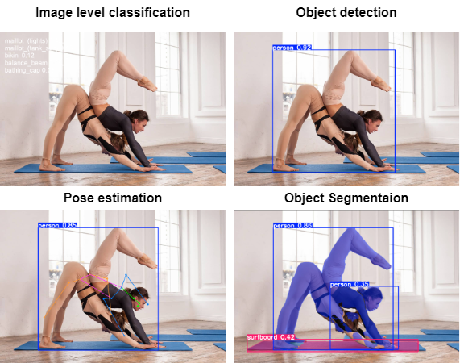

# Object Detection and Analysis with YOLOv11

This repository demonstrates the use of [Ultralytics](https://www.ultralytics.com/) YOLOv11 for various tasks such as **object detection**, **image level classification**, **object segmentation**, **oriented object detection**, and **pose estimation**.

## Environment Setup

First, create a conda environment with Python 3.9:

```bash
conda create -n yolov11 python=3.9
conda activate yolov11
```
## Install the necessary packages using pip:
```
pip3 install torch torchvision torchaudio --index-url https://download.pytorch.org/whl/cu118
pip install ultralytics
```


## Configuration
Before running the application, update the data location path in the configuration file. Open `./configs/coco8.yaml` with Notepad++ (download it from [Notepad++](https://notepad-plus-plus.org/downloads/)) and modify the path as necessary.

## Running demo
To run the application, execute the main.py script:
```commandline
python demo.py
```
The application will load the model, process the images, and display the results. The output will be saved in the output folder.





## Train and Evaluate the Model
Modify (as needed) and run the following scripts. To train:
```commandline
python train.py
```
you will find the trained model in the `./runs` folder. 

To evaluate the model:
```commandline
python eval.py
```

Check [ultralytics configurations](https://docs.ultralytics.com/usage/cfg/#modes) to familiarize yourself with the Model class and parameters.


## Export the Model to ONNX Format
To export your trained model to ONNX format, use the following line in your code:
```commandline
path = model.export(format="onnx")  # return path to exported model
```
